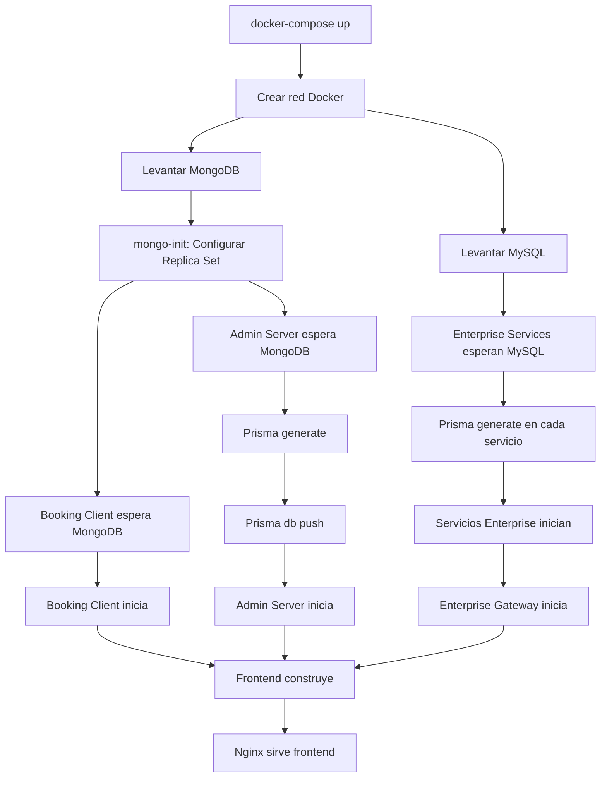

# 📁 Estructura de Archivos Docker - Encore

```
Encore/
│
├── 📄 docker-compose.yml              # Orquestación principal de servicios
├── 📄 docker-compose.dev.yml          # Solo bases de datos para desarrollo
├── 📄 .env.example                    # Template de variables de entorno
├── 📄 .dockerignore                   # Archivos ignorados por Docker
│
├── 📖 DOCKER_README.md                # Documentación completa de Docker
├── 📖 QUICKSTART.md                   # Guía rápida de inicio
├── 📖 docker-healthchecks.yml         # Configuración de health checks
│
├── 🔧 docker-manager.ps1              # Script de gestión para Windows
├── 🔧 verify-docker-setup.ps1         # Script de verificación pre-docker
├── 🔧 Makefile                        # Comandos simplificados (Linux/Mac)
│
├── 📦 booking_client/
│   ├── Dockerfile                     # Express + Mongoose
│   └── wait-for-it.sh                 # Script de espera para MongoDB
│
├── 📦 admin_server/
│   ├── Dockerfile                     # Fastify + Prisma
│   ├── wait-for-it.sh                 # Script de espera
│   └── prisma-start.sh                # Generar Prisma + iniciar
│
├── 📦 frontend/
│   ├── Dockerfile                     # Angular + Nginx (multi-stage)
│   └── nginx.conf                     # Configuración de Nginx
│
└── 📦 enterprise_server/
    ├── Dockerfile.gateway             # NestJS Gateway
    │
    └── microservices/
        ├── enterprise-service/
        │   ├── Dockerfile
        │   ├── wait-for-it.sh
        │   └── prisma-start.sh
        │
        ├── category-service/
        │   ├── Dockerfile
        │   ├── wait-for-it.sh
        │   └── prisma-start.sh
        │
        └── product-service/
            ├── Dockerfile
            ├── wait-for-it.sh
            └── prisma-start.sh
```

---

## 🎯 Archivos Clave

### 1. `docker-compose.yml` - Orquestación Principal
Define 9 servicios:
- **mongo** + **mongo-init**: MongoDB con Replica Set
- **mysql**: Base de datos para Enterprise
- **booking_client**: API Express (puerto 4000)
- **admin_server**: API Fastify (puerto 3000)
- **enterprise_gateway**: Gateway NestJS (puerto 5000)
- **enterprise_service**: Microservicio (puerto 5001)
- **category_service**: Microservicio (puerto 5002)
- **product_service**: Microservicio (puerto 5003)
- **frontend**: Angular + Nginx (puerto 80)

### 2. `.env.example` - Variables de Entorno
Configuración para:
- Conexiones MongoDB
- Conexiones MySQL
- Puertos de servicios
- Secretos JWT
- Claves Stripe
- URLs de APIs

### 3. Dockerfiles por Servicio

#### **booking_client/Dockerfile**
```dockerfile
FROM node:20-alpine
# Instala dependencias
# Copia código
# Expone puerto 4000
CMD ["npm", "start"]
```

#### **admin_server/Dockerfile**
```dockerfile
FROM node:20-alpine
# Instala Prisma
# Genera Prisma Client
# Aplica migraciones
# Inicia servidor
```

#### **frontend/Dockerfile** (Multi-stage)
```dockerfile
# Stage 1: Build
FROM node:20-alpine
# Compila Angular

# Stage 2: Production
FROM nginx:alpine
# Sirve con Nginx
```

### 4. Scripts de Utilidad

#### **docker-manager.ps1** (Windows)
```powershell
.\docker-manager.ps1 up      # Levantar
.\docker-manager.ps1 down    # Detener
.\docker-manager.ps1 logs    # Ver logs
.\docker-manager.ps1 clean   # Limpiar todo
```

#### **Makefile** (Linux/Mac)
```bash
make up        # Levantar
make down      # Detener
make logs      # Ver logs
make clean     # Limpiar todo
```

#### **wait-for-it.sh**
Script que espera a que bases de datos estén listas antes de iniciar servicios.

#### **prisma-start.sh**
1. Genera Prisma Client
2. Aplica migraciones
3. Inicia servicio

---

## 🚀 Flujo de Inicio



---

## 📊 Puertos y Servicios

| Servicio | Puerto Host | Puerto Contenedor | Base de Datos |
|----------|-------------|-------------------|---------------|
| Frontend | 80 | 80 | - |
| Admin Server | 3000 | 3000 | MongoDB |
| Booking Client | 4000 | 4000 | MongoDB |
| Enterprise Gateway | 5000 | 5000 | - |
| Enterprise Service | 5001 | 5001 | MySQL |
| Category Service | 5002 | 5002 | MySQL |
| Product Service | 5003 | 5003 | MySQL |
| MongoDB | 27017 | 27017 | - |
| MySQL | 3306 | 3306 | - |

---

## 🔒 Seguridad

**Antes de producción, revisa:**

✅ `.env` tiene secretos seguros (no usar valores por defecto)
✅ Contraseñas de bases de datos son complejas
✅ JWT_SECRET es aleatorio y largo
✅ Claves Stripe son de producción
✅ CORS configurado para dominios específicos
✅ Nginx tiene headers de seguridad
✅ No expongas puertos internos (5001-5003) en producción

---

## 📝 Notas Adicionales

- **Volúmenes persistentes**: `mongo_data` y `mysql_data` mantienen datos entre reinicios
- **Red interna**: `encore_network` permite comunicación entre servicios
- **Hot reload**: Usa `docker-compose.dev.yml` para desarrollo local
- **Health checks**: Ver `docker-healthchecks.yml` para configuración avanzada
- **Logs**: `docker-compose logs -f [servicio]` para debugging

---

## 🎓 Recursos de Aprendizaje

- [Docker Docs](https://docs.docker.com/)
- [Docker Compose Docs](https://docs.docker.com/compose/)
- [Dockerfile Best Practices](https://docs.docker.com/develop/develop-images/dockerfile_best-practices/)
- [Multi-stage Builds](https://docs.docker.com/build/building/multi-stage/)

---

✨ **¡Tu aplicación Encore está lista para Docker!**
